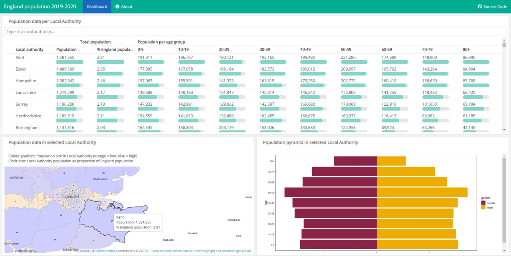

# dhsc_dashboard_dummy_version

This is a dummy version of a dashboard with Covid-19 data that I developed during my time at the [Department of Health and Social Care (DHSC)](https://www.gov.uk/government/organisations/department-of-health-and-social-care).

As the original dashboard contained sensitive data, I have developed this dummy version for presentation purposes and for making the code open to everyone.

The dummy dashboard presents England population data in different ways:

1. An interactive table with population data per area and age group.
2. An interactive map with population data per area.
3. A population pyramid for each area and age group.

I wouldn't have been able to develop this dashboard without access to open Source code and data:

**Data sources**

- Map: [Counties and Unitary Authorities (December 2019) Boundaries UK BUC](https://geoportal.statistics.gov.uk/datasets/counties-and-unitary-authorities-december-2019-boundaries-uk-buc/data), Office for National Statistics.
- Population pyramid: [Mid-2019: April 2020 local authority district codes](https://www.ons.gov.uk/peoplepopulationandcommunity/populationandmigration/populationestimates/datasets/populationestimatesforukenglandandwalesscotlandandnorthernireland), Office for National Statistics.

**References**

- The code for building this dashboard benefited from open-source code and ideas that we tailored to our own needs, in particular from:
  1. [Trafford Data Lab's Covid-19 project](https://github.com/traffordDataLab/covid-19.git). 
  2. [Travelling Tabby's UK Coronavirus Tracker](https://www.travellingtabby.com/uk-coronavirus-tracker/).
  3. [Kyle Cuilla's 2019 NFL Team Ratings](https://kcuilla.netlify.app/post/2019-nfl-team-ratings/).